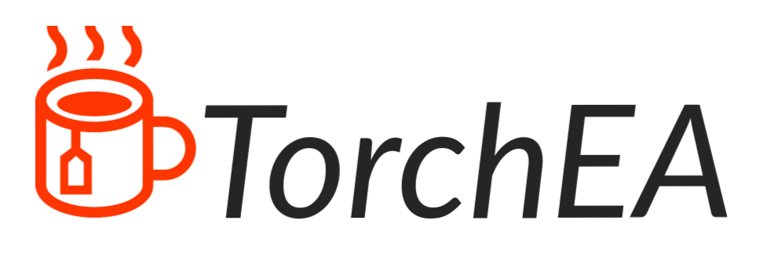

# torchea
Training and construction of torch models based on evolutionary algorithms

# Contents
- [Introduction](#introduction)
- [About evolutionary algorithms](#about-evolutionary-algorithms)
- [Advantages](#advantages)
- [Disadvantages](#disadvantages)
- [Installation](#installation)
- [Roadmap](#roadmap)

# Introduction

Целью данного репозитория является создание функций и алгоритмов для автоматического обучения и построения искуственных нейронных сетей на основе эволюционных алгоритмов. Эволюционные алгоритмы способны хорошо находить нужную комбинацию из огромного количества вариантов(подбор весов и архитектуры можно представить как комбинаторную задачу). Этот репозиторий построен на pytorch и имеет все его преимущества.

The purpose of this repository is to create functions and algorithms for automatic learning and building artificial neural networks based on evolutionary algorithms. Evolutionary algorithms are good at finding the right combination from a huge number of variants (the selection of weights and architecture can be thought of as a combinatorial problem). This repository is built on pytorch and has all its advantages.

Translated with www.DeepL.com/Translator (free version)

# About evolutionary algorithms

Эволюционные алгоритмы могут хорошо решать комбинаторные задачи. Они имитируют механизм эволюции природы и могут найти хорошую комбинацию как вещественных, так и дискретных значений относительно заданной функции или функций приспособленности. При этом они перебирают не все возможные варианты, а лишь небольшую часть возможных вариантов. Это очень похоже на то, что происходит с искусственной нейронной сетью при ее обучении, ведь обучение нейронной сети можно представить как нахождение подходящих вещественных чисел матриц.

Evolutionary algorithms can solve combinatorial problems well. They simulate the mechanism of nature's evolution and can find a good combination of both real and discrete values with respect to a given function or functions of adaptability. In doing so, they do not go through all the possible choices, but only a small fraction of the possible choices. This is very similar to what happens to an artificial neural network when it is trained, because training a neural network can be thought of as finding suitable real numbers of matrices.

Translated with www.DeepL.com/Translator (free version)

Эволюционные алгоритмы это лишь направление. Они бывают разных видов и для достижения целей будут использоваться генетические алгоритмы и дифференциальная эволюция. Чтобы решить задачу, эволюционные алгоритмы оперируют признаками особей. Особью мы будем считать модель, а признаками мы будет считать слои(как они понимаются в pytorch), наличие связи между нейронами(если значение матрицы весов равняется нулю, то связи между нейронами нет) и веса этих связей.

Evolutionary algorithms are just a direction. They come in different kinds and genetic algorithms and differential evolution will be used to achieve the goals. To solve the problem, evolutionary algorithms operate on traits of individuals. We will consider the model as an individual, and we will consider layers (as they are understood in pytorch), the presence of connections between neurons (if the value of the weight matrix equals zero, then there are no connections between neurons), and the weights of these connections.

Translated with www.DeepL.com/Translator (free version)

# Advantages
- Отсутсвует проблема затухающего градиента. При работе методов дифференциальной эволюции изменяются все значения матриц, а не очерёдно от выхода нейронной сети ко входу нейронной сети.
- При обучении могут эволюционные алгоритмы могут поддерживать несколько функций потерь(в эволюционных алгоритмах они называются функциями приспособленности).

- There is no damped gradient problem. When differential evolution methods work, all matrix values change, not one by one from the output of the neural network to the input of the neural network.
- During training, evolutionary algorithms can support several loss functions (in evolutionary algorithms they are called fitness functions).

Translated with www.DeepL.com/Translator (free version)

# Disadvantages
- Эволюционные алгоритмы оперируют признаками особей(моделей). Этих особей должно быть больше одной. Чем их больше, тем лучше работают алгоритмы. 

- Evolutionary algorithms operate on traits of individuals (models). There must be more than one of these individuals. The more there are, the better the algorithms work.

Translated with www.DeepL.com/Translator (free version)

# Installation
Instalation from PyPi   
```
pip3 install torchea
```

Instalation from source for debug
```
git clone https://github.com/parvector/torchea.git

pip3 install -e ".[dev]"
```

# Roadmap

### 1. Самый первый функционал

- [ ] Реализовать функции для инициализации весов на основе функций инициализации pytorch и написать для них тесты

- [x] Реализовать функцию мутации из [файла](./docs/articles/Storn%2C%20Rainer%20and%20Price%2C%20Kenneth.%20Differential%20Evolution%20%E2%80%94%20A%20Simple%20and%20Efficient%20Heuristic%20for%20Global%20Optimization%20over%20Continuous%20Spaces.%20ournal%20of%20Global%20Optimization%2011%3A%20341%E2%80%93359%2C%201997..pdf) на странице 344.
